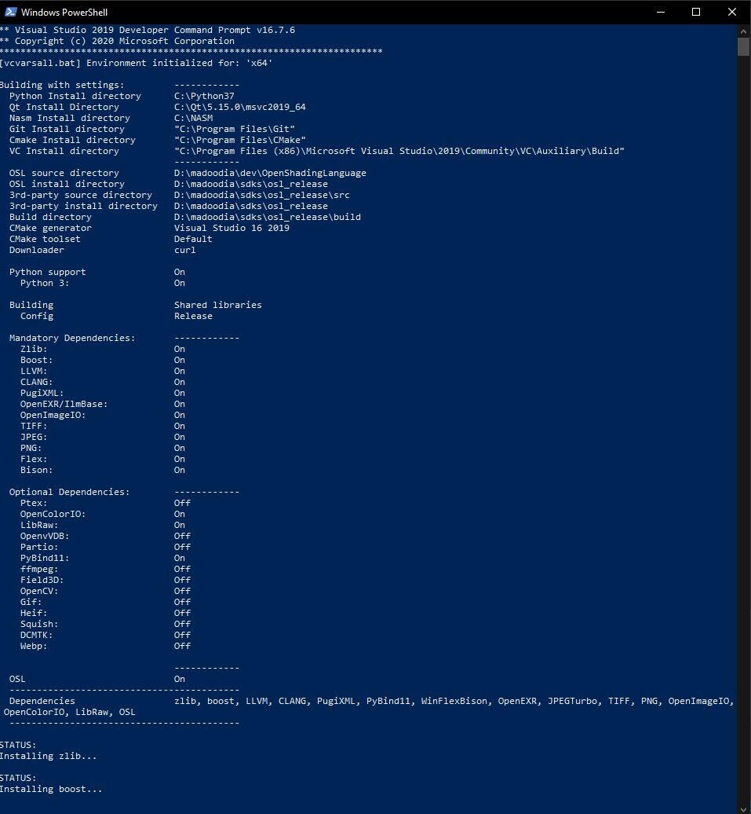

## **Building, Using and Debugging OSL in Windows**

---

#### Copyright Contributors to the Open Shading Language project.

#### SPDX-License-Identifier: CC-BY-4.0

---

### **Contents**

1. Introduction
   - Experimental
   - My Setup
   - Inspiration
2. Preparing Environment
   - Cleaning Up the PATH
   - Set-Up needed Environment Variables
   - Set Flags based on your needs
3. Building (Release, Debug)
   - Running the code based on your config
   - Be Patient
   - Errors
4. Running
5. Development in Windows

---

### **1. Introduction**

This document is prepared for those who have problem in building OSL in Windows OS, this is completely custom setup. And it is developing to make it compatible with all situations.

(`Disclaimer: This Process is completely Experimental and it worked on my system, maybe you get error with changing some configs, during this process). At a first glance it seems to be complicated, but it is very easy to do, bare with me :)
So it would be great to share our experiences to reach to best way of building in Windows (and of course other Operating Systems) to save our time and energy to focus on OSL development and OSL Shader writing.

### **1.1 Experimental**

After a lot of efforts on manual building OSL on Windows, Finally I found a clean way to do that, I explained every steps I did, I hope it works for you too. This method is stricktly related to Environment Variables you create and Flags you set to the command and need patient and hard disk.

I've built OSL with minimal needed packages, for extra packages, they should be set as flag (**script is under development**)

### **1.2 My Setup**

This is my setup I have on my PC for building OSL, so you need to install some software before start.

My System and Setup Configuration:

**OS:** Windows 10 Home

**Compiler:** Microsoft Visual Studio 2019

**Git:** 2.28.0

**Python:** 3.7 tip: disable python App Installer in Manage `App Execution Aliases (Windows 10)`

**Cmake:** 3.18.4

**Qt:** 5.15.0

**NASM:** 2.15.05 for JPEG

**OpenShadingLanguage:** cloned from latest master branch

**Boost:** 1.70

**LLVM:** 11.0.0 C++ is set on C++14

**CLANG:** 11.0.0 C++ is set on C++14

**WinFlexBison:** 2.5.22

**Zlib:** 1.2.11

**JPEG:** 2.0.5

**TIFF:** 4.1.0

**PNG:** 1.6.35

**PyBind11:** 2.6.0

**LibRaw:** 0.20.2

**OpenImageIO:** 2.1.20

**OpenColorIO:** 1.1.0

**OpenEXR/**IlmBase: 2.5.3

**GLUT:** 3.2.1 freeglut on windows (this is needed for partio) (unfortunately Partio didn't build, it has a problem) (I’ve created a PR for it in Disney github repo)

**Disney Partio:** latest from master (zip file) (Skip this for now) (I didn't build OSL with Partio)

**PugiXML:** 1.10

---

### **1.3 Inspiration**

After lots of manual building dependencies one by one and fix errors and things I got inspired by `PIXAR USD INSTALLATION METHOD` and borrowed its structure to build OSL.

so I studied its python build script and found we can use same logic for installing OSL, fortunately after changing and adding OSL needed packages and some custom setup it worked fine
It still needs some other works to make it complete for all dependencies (optional).

We will keep Pixar name on it as inspiration code (or we can keep their copyright)
You can Run the installer from: `yourpath/OpenShadingLanguage/doc/build_install/windows/build_osl.bat`

---

### **21. Preparing Environment**

There are bunch od prerequisites for building OSL that I explained in following sections.

### **2.1 Cleaning Up the PATH**

Be sure you don't have any custom item added to PATH in your global Environment Variables of Windows

You can do it:

`Start Menu > Edit the system environmment variables > Environment Variables > User Variables/System Variables`

so you should not have any path that refer to previous osl installation folders

Recommendation: remove added path for cmake, git, python, Qt, llvm

it should be clean now.

### **2.2 Set-Up needed Environment Variables**

For running batch scripts without any problem I recommend to create some base environment variables.

**Needed Environment Variables: (Key/Value based on my installation folder)**

| Env Var         | Path Example                                                                       |
| --------------- | ---------------------------------------------------------------------------------- |
| BASE_LOCATION   | D:\madoodia\sdks                                                                   |
| PYTHON_LOCATION | D:\madoodia\sdks                                                                   |
| QT_LOCATION     | C:\Qt\5.15.0\msvc2019_64                                                           |
| NASM_LOCATION   | C:\NASM                                                                            |
| GIT_LOCATION    | "C:\Program Files\Git"                                                             |
| CMAKE_LOCATION  | "C:\Program Files\CMake"                                                           |
| VCVARS_LOCATION | "C:\Program Files (x86)\Microsoft Visual Studio\2019\Community\VC\Auxiliary\Build" |

|

Open `doc/build_install/windows/osl_env_vars_setup.bat` in your editor and edit paths' values based on your installation folders.

### **2.3 Set Flags based on your needs**

The main build launcher is here `doc/build_install/windows/build_osl.bat`

For now we can not assign pre-installed llvm or boost so we have to build all together at once and put all of them in one directory.

I am working on it to see how we can use external llvm and boost installation without error.

**Table of flags we can assign to the command**

| Flag          | State           | Can Use |
| ------------- | --------------- | ------- |
| --osl         | Implemented     | Yes     |
| --python      | Implemented     | Yes     |
| --zlib        | Implemented     | Yes     |
| --boost       | Implemented     | Yes     |
| --llvm        | Implemented     | Yes     |
| --clang       | Implemented     | Yes     |
| --pugixml     | Implemented     | Yes     |
| --openexr     | Implemented     | Yes     |
| --tiff        | Implemented     | Yes     |
| --jpeg        | Implemented     | Yes     |
| --png         | Implemented     | Yes     |
| --flex        | Implemented     | Yes     |
| --bison       | Implemented     | Yes     |
| --opencolorio | Implemented     | Yes     |
| --openimageio | Implemented     | Yes     |
| --libraw      | Implemented     | Yes     |
| --pybind11    | Implemented     | Yes     |
| --Ptex        | Implemented     | No      |
| --openvdb     | Implemented     | No      |
| --partio      | Implemented     | No      |
| --ffmpeg      | Not-Implemented | No      |
| --field3d     | Not-Implemented | No      |
| --opencv      | Not-Implemented | No      |
| --gif         | Not-Implemented | No      |
| --heif        | Not-Implemented | No      |
| --squish      | Not-Implemented | No      |
| --dcmtk       | Not-Implemented | No      |
| --webp        | Not-Implemented | No      |

---

### **3. Building (Release, Debug)**

We Prepared some batch files to do it for you automatically.
Based on Environment Variables you set in previous sections you can just call them and wait for it to be built and installed.

**My Method:**

- Open Powershell
- Go to: yourPath/OpenShadingLanguage/doc/build_install/windows
- Run build_osl.bat release

### **3.1 Running the code based on your config**

Based on the config (`Release` or `Debug`) that you send for installer it will create directory in `BASE_LOCATION` for you

`BASE_LOCATION/osl_release` for Release mode

`BASE_LOCATION/osl_debug` for Debug mode

**IMPORTANT:** `Good to know you can not have Release and Debug files in one directory at the same time, it makes conflict and give you weired errors. So keep them separate.`

### **3.2 Be Patient**

You should be patient because the whole process (based on your PC config) takes time between 30 minutes to 1 hour

And it takes:

**Release:** `~8Gb` of your hard disk (after installation) (Download size is `~350Mb`)

**Debug:** `~90Gb` of your hard disk (after installation) (Download size is `~400Mb`)

so please set a location to `BASE_LOCATION` that have enough space.

### **3.4 Errors**

If you got any error in any step of building process, you can remove the related package's build directory from `BASE_LOCATION/build` and run the installer again.

If you got any error please report to the forum of OSL.

---

### **4. Running**

We Prepared some batch files to do it for you automatically. Based on Environment Variables you set in previous sections you can just call it.

**Recommendation:** use `Powershell`

**TIP:** If you add your osl installation folders (both release and debug) in global Windows Environment Variable, you will get error.

So you can add release path or debug path in your global environment variables. Or create and use batch scripts.
For adding path you should add these two paths to your global env variables:

• PATH : `<osl install dir>\bin`;

• PATH : `<osl install dir>\lib`;

For example, you can open osltoy in releae mode with running `osltoy_release_launcher.bat`

if you have question, feel free to ask.

---

### **5. Development in Windows**

After editing your code, when you want to see your changes you should build osl again. But this time, it is so faster than before, (if you keep build folders) So just need to rebuild it in release mode.

**Release mode**:

- open powershell
- cd OpenShadingLanguage repo
- cd build_script
- run build_osl.bat release
- run osl_release_sln.bat
- example: set osltoy as default project
  - run it in release x64 mode

**Debug mode**:

- open powershell
- cd OpenShadingLanguage repo
- cd build_script
- run build_osl.bat debug
- run osl_debug_sln.bat
- example: set osltoy as default project
  - run it in debug x64 mode

If you open Visual Studio solution (sln) from release or debug, you can build it from inside it after your code editing

I recommend using: (in **powershell**)

- **osl_release_sln.bat** or **osl_debug_sln.bat**

now you can use Visual Studio for debugging.

---

**TIP about OSLToy:**

If you load a shader in `osltoy` and when hit Recompile, it is crashed and closed, probabely your output color attribute name is not `Cout`

It is mandatory to have at least one `Cout` output Variable in any shader, Otherwise osltoy will crash.

That's it

TIP: this process is getting better, I will update the document soon

**Conclusion:**
For easy installation you just need to setup your Environment Variables in `yourPath/OpenShadingLanguage/doc/build_install/windows/osl_env_vars_setup.bat` based on your paths

`Reza Aarabi` (`madoodia.com`)

---

**Additional information from Reza:**

It is a custom setup, for example all dependencies are built before osl, because I had lots of issues on using external installation (like llvm)
and I tried this method on llvm 7, 8 and 9, all with error, so my current build setup is on llvm 11 and C++14, it can be changed in code. (I am trying to make it easy to use for changing configs with arguments)

Please take a look at docs and let me know my mistakes.

This method worked fine for me for release, debug and debugging in visual studio.

I am trying to build OSL on `Linux` with same method. If it worked fine I will Update the build system.

