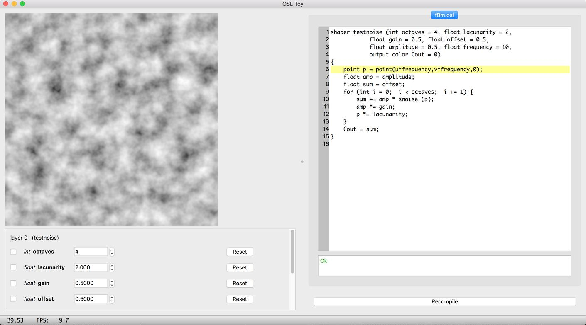
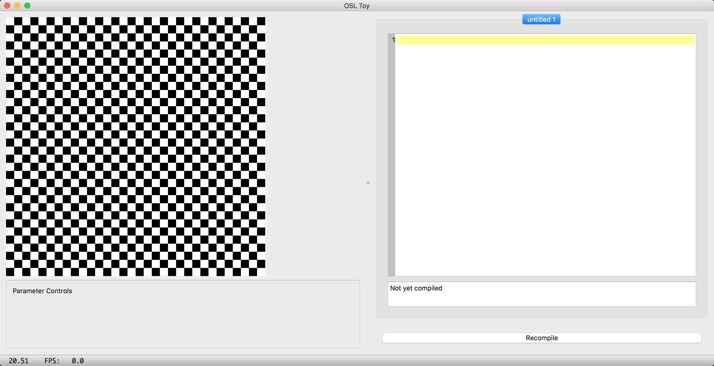
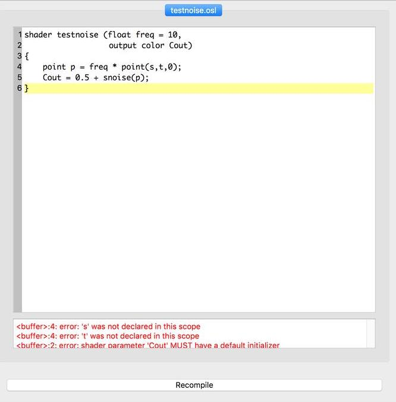

---
numbering:
  heading_1: true
  heading_2: true
  heading_3: true
---

<!--
  Copyright Contributors to the Open Shading Language project.
  SPDX-License-Identifier: CC-BY-4.0
-->


(chap-osltoy)=
# osltoy: Interactive Shader Editor and Visualizer

`osltoy` is an interactive editor and realtime visualizer for OSL shaders.
It is inspired by [Shadertoy](https://www.shadertoy.com/) by Inigo Quilez,
but uses a real VFX shading language!




## Command Line

Launch `osltoy` from the command line:

`osltoy` [*options*] [*filename.osl* ...]

Command line options:

`--help`
: Print command line options and other help.

`-v`
: Verbose mode.

`--res` *xres* *yres*
: Specifies the resolution of the render window (default: 512 × 512).

`--threads` *n*
: Specifies the number of simultaneous threads to use for shading. If not
  specified, it will use all available hardware cores.

*filename.osl*
: If one or more filenames of shader source code are specified, they will
  be loaded into editor tabs upon startup.


## osltoy Basics

First, let's launch `osltoy`:

```
$ osltoy
```



This will start a new `osltoy` session. On the right half of the GUI is a
code editor window. Below the code editor is an area that will show any
compilation errors. The left half of the GUI displays the results of the
shader (a checkerboard if no shader has been compiled yet). Below that is
an area that will hold widgets to allow adjustment of shader parameter
values.

At the very bottom of the app window is a status bar showing time, frames
per second, and other status messages. At the very top (or, on macOS, at
the top of the screen) is a menu bar with the usual set of common
operations.

### Loading and saving shaders

You can load a shader one of three ways:

1. Specify the filename of an existing shader when you launch the app:
   ```
   osltoy test.osl
   ```

2. From a blank window, load an existing shader by selecting `File` →
   `Open`, or using the hotkey `Ctrl-O` (⌘`-O` on macOS). This will
   present a file selection dialog.

3. Just start typing in the editor window.

You can save the edited shader with `File` → `Save` or `Ctrl-S` (⌘`-S`
on macOS). If the file does not yet have a name, you will be presented
with a file save dialog (as you will if you use `File` → `Save As`).

:::{note}
Throughout this document, `Ctrl-`*key* combinations correspond to ⌘`-`*key*
on macOS.
:::

### Compiling shaders

When you have loaded or edited your OSL source code, you can compile the
shader with `Tools` → `Recompile shaders`, by clicking the `Recompile`
button below the source code editor widget, or by using the hotkey `Ctrl-R`.

:::{warning}
`osltoy` won't compile a buffer that doesn't have a filename ending in
`.osl`. If you started with a blank window, the buffer won't have a name
until you save the first time.
:::

In the compilation status window below the editor, you will either see an
`Ok` message if the compiler succeeded, or the error output from the
compiler:

{width=512px}

:::{warning}
`osltoy` appears to let you load or create multiple shaders in a tabbed
editor. This will eventually support editing whole shader groups, but
currently only the shader in the first tab will be compiled and executed.
:::

### Executing shaders and interactive changes

Once you compile the shader successfully, it will execute and display the
results of shading a rectangle.


As soon as you recompile, the shader will be executed and displayed as an
image on the left, with shader parameter adjustment widgets below it.

Every time you change a parameter value through its widget, the shader will
automatically recompile and re-execute. If you edit the shader text,
clicking `Recompile` or using `Ctrl-R` will recompile and re-execute.


## Shader Inputs and State

The shader is executed on every pixel of an image (defaulting to 512×512,
but changeable via the `--res` command line flag).

The `float u` and `v` global variables vary from 0 to 1 across the
rectangle.

The `point P` global variable will be set to `(x, y, 0)`, where `x` is
the pixel horizontal coordinate (0 to xres-1, left to right) and `y` is
the pixel vertical coordinate (0 to yres-1, top to bottom).

The `float time` global variable contains the time (in seconds) since the
last time the shader was recompiled. Making your shader change its behavior
based on `time` creates an animated shader.

## Shader Outputs

The color displayed is taken from the shader output parameter declared as:

```
output color Cout = 0
```

Whatever you place in that output will be the color displayed at each pixel
of the output image.

:::{note}
Your shader does not need to set `Ci` or deal with closures. `osltoy` is
just for exploring pattern generation, not illumination. It has no notion
of 3D geometry or lights.
:::

## Shader Execution

If your shader does not reference the `time` variable in any way, it will
only be executed once each time it recompiles. If `time` appears in your
shader, it will execute repeatedly, as quickly as possible, until you exit
or recompile.

Shader execution will by default use enough threads to keep all your cores
busy. The `--threads` command line option can limit the number of cores (or
"over-thread").


## Caveats and Limitations

These are current limitations that will be fixed over time.

* The GUI seems to let you open multiple editor tabs, but currently only the
  first tab (farthest to the left, with a name ending in `.osl`) will
  compile and execute.

* We intend to add "Pause" and "Reset" buttons to control time.

* Parameter adjustment widgets are still being refined to handle varying
  value ranges correctly.

* There is not yet a way for the shader to receive information about
  external events such as mouse clicks or key presses.

* There is not yet a way for the shader to have *state* that persists
  between frames.


## Things to Try

* Try this:

  ```
  osltoy <osl_install_directory>/shaders/mandelbrot.osl
  ```

* Use the global `time` variable to make animated patterns.

* Explore noise functions and other pattern generation interactively.

* Keep an eye on the "FPS" reading at the bottom to see what shader
  operations are fast and what is slow.

* Don't forget that `texture()` calls work in `osltoy`!

* `osltoy` is a great tool for learning or *teaching* OSL.

* The actual "geometry" is just a rectangle, but like with Shadertoy,
  you can make patterns that *look like* 3D geometry by implementing a
  simple ray tracer in the shader itself, or using other clever tricks.

* Look at the many examples on [Shadertoy](https://www.shadertoy.com/)
  for inspiration!

* Make something and share it on the `osl-dev` mailing list!
