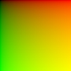
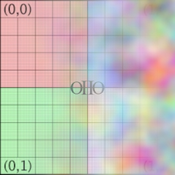
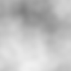
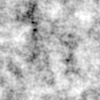
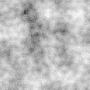
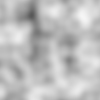
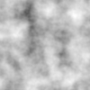
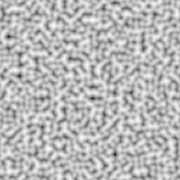

---
numbering:
  heading_1: true
  heading_2: true
  heading_3: true
---

<!--
  Copyright Contributors to the Open Shading Language project.
  SPDX-License-Identifier: CC-BY-4.0
-->


(chap-testshade)=
# testshade: Shader Unit Tests, Texture Baking, and Benchmarks

The OSL software distribution includes `testshade`, a command-line utility
written for OSL unit tests and as a "test harness" for executing shaders in
isolation from any particular rendering system.

`testshade` is very flexible, with many potential uses in a production
studio, including:

* Unit testing production shaders (particularly utility shader nodes)
  without the overhead of a full render or the trouble of constructing a
  full scene.

* Providing a "test harness" for debugging shaders (or OSL itself).

* Baking procedural patterns into textures.

* Benchmarking shaders and evaluating their performance, including
  comparative tests such as "is it faster to code it this way or that way?"

* Exploring the inner workings of OSL's runtime optimizer, to answer
  questions like: "will this idiom optimize away at runtime when I use
  the default parameter values?"


## Running a Shader Once

Let's run testshade on a simple shader:

```
shader hello (float a = 0, float b = 1)
{
    printf ("hello, a+b = %g\n", a+b);
}
```

Compile your shader as usual:

```
$ oslc hello.osl
Compiled hello.osl -> hello.oso
```

Now run the shader in the `testshade` harness:

```shell
$ testshade hello
hello, a+b = 1
```


## Setting Parameters

You can set the value of shader parameters (that is, per-material
*instance value* overrides of the default values) using

   `--param` *name* *value*

prior to the name of the shader to load. For example,

```shell
$ testshade --param a 3.14 --param b 5.0 hello
hello, a+b = 8.14
```

The type of data you pass is inferred from the value's format:

| Formatting | OSL type | Example |
|---|---|---|
| single whole number | `int` | `42` |
| single number with decimal | `float` | `42.0` |
| three comma-separated numbers (no spaces) | `color`, `point`, `vector`, or `normal` | `0.6,0.35,0.99` |
| 16 comma-separated numbers (no spaces) | `matrix` | `1,0,0,0,0,1,0,0,0,0,1,0,0,0,0,1` |
| anything else | `string` | `"Now is the time..."` |

Be careful to match the types of your parameters correctly, or you will see
an error like this (note that we pass `b` as `5` rather than `5.0`):

```shell
$ testshade --param a 3.14 --param b 5 hello
WARNING: attempting to set parameter with wrong type: b (expected 'float', received 'int')
hello, a+b = 4.14
```

For other types, or to resolve ambiguities (for example if you want three
numbers as `float[3]` rather than `vector`, or want to pass the *string*
`"1"` instead of an integer), specify the type explicitly using an optional
modifier `--param:type=`*mytype*:

```shell
$ testshade --param:type=color c 0,0,0 --param:type=string s "1" testshader
```

## Saving Outputs to Images

Most shaders don't have `printf()` calls. Let's consider a more typical
shader with real outputs and spatially-varying behavior:

```
shader show_uv (output color out = 0)
{
    out = color (u, v, 0);
}
```



```shell
$ oslc show_uv.osl
Compiled show_uv.osl -> show_uv.oso

$ testshade -g 100 100 show_uv -o out uv.jpg
Output out to uv.jpg
```

Helpful command line arguments:

`-g` *xres yres*
: Specifies the resolution of the "grid" to shade. For example, `-g 512 256`
  will shade 512 horizontal samples by 256 vertical samples. The default
  is 1×1, shading only one location.

`-o` *variable* *filename*
: Specifies that *variable* (which must be a shader `output` parameter)
  should be saved to *filename*. You may have multiple `-o` commands, each
  saving a different output variable to a different file.

`-d` *datatype*
: By default, image files save `float` data. This option selects an
  alternative pixel data format. For example,

  ```
  testshade -g 100 100 show_uv -od uint8 out.tif
  ```

  will ensure that `out.tif` is written with 8-bit integer pixels.

`--print`
: Overrides `-o` outputs to print values to the console instead of saving
  images. Useful only for very small grids.

`--offsetuv` *uoffset voffset* `--scaleuv` *uscale vscale*
: Controls the range of the `u` and `v` surface parameters over the
  shading grid. The default has the leftmost column at `u=0`, the rightmost
  at `u=1`, the top scanline at `v=0`, and the bottom scanline at `v=1`.

  For example, to make the uv range go from 0–2 rather than 0–1:

  ```
  testshade -g 100 100 show_uv --scaleuv 2 2 -od uint8 out.tif
  ```


## Specifying Shader Networks

`testshade` can specify and execute entire shader groups (networks of
shader nodes). Let's make a simple shader network as an example.

We have the following shaders:

```
shader texturemap (string texturename = "", output color out = 0)
{
    out = texture (texturename, u, v);
}

shader contrast (color in = 0, color mid = 0.5, color scale = 1,
                 output color out = 0)
{
    color val = in - mid;
    val *= scale;
    out = val + mid;
}

shader noisy (point position = P, float frequency = 1,
              output color out = 0)
{
    point p = position * frequency;
    color fBm =        (color) snoise(p)
              + 0.5  * (color) snoise(p*2)
              + 0.25 * (color) snoise(p*4);
    out = 0.5 + 0.5*fBm;
}

shader umixer (color left = 0, color right = 0, output color out = 0)
{
    out = mix (left, right, smoothstep (0, 1, u));
}
```

And we wish to construct the following shader group:

```
 .------------.out     in.----------.out
 | texturemap +--------->| contrast +---.
 '------------'          '----------'    \ left .--------.out
                                          '---->| umixer +--->
                                  .------------>|        |
      .------------.out          /        right '--------'
      |   noisy    +------------'
      '------------'
```


### Simple Networks on the Command Line: `--layer` and `--connect`

For relatively simple networks, specify them on the `testshade` command
line using these commands:

`--param` *name* *value*
: Sets a parameter *of the next declared shader*. You may intersperse
  `--param` and named shaders and set parameters separately for each of
  them. For example:

  ```
  testshade --param a 1 --param b 2 shader1 --param c 0 shader2
  ```

  sets parameters `a` and `b` of *shader1* and parameter `c` of *shader2*.

`--shader` *shadername* *layername*
: Creates a new shader node of the kind named by *shadername*, and binds
  any pending `--param` settings to that shader node. The node is assigned
  the label *layername*, which may be used with `--connect` directives
  later on the command line.

`--connect` *layer1 param1 layer2 param2*
: Establishes a connection from shader *layer1*'s output parameter *param1*
  to shader *layer2*'s input parameter *param2*. Both layers must have been
  named via `--shader` earlier on the command line.

The following declares the shader network described above:

{width=180px}

```shell
$ testshade --param texturename "grid.tx" \
            --shader texturemap tex1 \
            --param frequency 4.0 \
            --shader noisy noise1 \
            --param scale 1.0 \
            --shader contrast cont1 \
            --shader umixer mix1 \
            --connect tex1 out cont1 in \
            --connect cont1 out mix1 left \
            --connect noise1 out mix1 right \
            -g 256 256 -o out noisetex.jpg
```


### Complex Networks: Deserializing with `--group`

For very complex networks, specifying many `--shader`, `--param`, and
`--connect` directives on the command line is unwieldy. OSL supports
serialization of shader group declarations. Please refer to the
[](shadergroups.md) chapter for details.

`--group` *groupspec*
: Specify an entire shader network using OSL's serialized shader group
  notation. The *groupspec* may be either the whole thing inline, or the
  name of a file containing the serialization.

The serialization corresponding to the shader group above is:

```
param string texturename "grid.tx" ;
shader texturemap tex1 ;
param float frequency 4.0 ;
shader noisy noise1 ;
param float scale 1.0 ;
shader contrast cont1 ;
shader umixer mix1 ;
connect tex1.out cont1.in ;
connect cont1.out mix1.left ;
connect noise1.out mix1.right ;
```

And so the equivalent command is:

```shell
$ testshade --group noisetex.shadergroup -g 256 256 -o out noisetex.jpg
```


## Shader Unit Testing

You can use `testshade` to run quick tests to verify the behavior of your
shaders, for example as part of a testsuite. Using `testshade` can be much
more convenient than testing in a renderer — you can easily run it on one
or a few points, it will execute very quickly, you do not need to build a
"scene" or invoke the whole renderer, and it is much more straightforward
to run test cases involving specific values.

Let's construct a concrete example:

```cpp
shader clamped_mix (color in1=0, color in2=0, float mask = 0,
                    output color out = 0)
{
    out = mix (in1, in2, clamp(0, 1, mask));
}
```

We think about this shader and come up with several test cases:

* mask=0, should return in1
* mask=1, should return in2
* mask=0.5, should return the average
* verify that mask < 0 clamps to in1
* verify that mask > 1 clamps to in2

So our unit test script might look like this:

```shell
testshade --print --param in1 1,2,3 --param in2 4,5,6 --param mask 0.0 clamped_mix -o out out.exr
testshade --print --param in1 1,2,3 --param in2 4,5,6 --param mask 1.0 clamped_mix -o out out.exr
testshade --print --param in1 1,2,3 --param in2 4,5,6 --param mask 0.5 clamped_mix -o out out.exr
testshade --print --param in1 1,2,3 --param in2 4,5,6 --param mask -1.0 clamped_mix -o out out.exr
testshade --print --param in1 1,2,3 --param in2 4,5,6 --param mask 2.0 clamped_mix -o out out.exr
```

Resulting in:

```
Output out to out.exr
Pixel (0, 0):
  out : 4 5 6
Output out to out.exr
Pixel (0, 0):
  out : 4 5 6
...
```

Wait — **that's not right at all!**

Good thing we unit-tested this shader. Do you see the bug? We wrote the
arguments to `clamp()` in the wrong order. Here is the correct shader:

```cpp
shader clamped_mix (color in1=0, color in2=0, float mask = 0,
                    output color out = 0)
{
    out = mix (in1, in2, clamp(mask, 0, 1));
}
```

And the new output from our tests is:

```
Output out to out.exr
Pixel (0, 0):
  out : 1 2 3
Output out to out.exr
Pixel (0, 0):
  out : 4 5 6
Output out to out.exr
Pixel (0, 0):
  out : 2.5 3.5 4.5
Output out to out.exr
Pixel (0, 0):
  out : 1 2 3
Output out to out.exr
Pixel (0, 0):
  out : 4 5 6
```

That's better. Unit tests are great!

We can also debug visual patterns. Let's look at a shader that computes
fractional Brownian motion:

```cpp
shader fBm (point position = P, int octaves = 4, float lacunarity = 2,
            float gain = 0.5, float offset = 0.5,
            float amplitude = 0.5, float frequency = 1,
            output float out = 0)
{
    point p = position * frequency;
    float amp = amplitude;
    float sum = offset;
    for (int i = 0;  i < octaves;  i += 1) {
        sum += amp * snoise (p);
        amp *= gain;
        p *= lacunarity;
    }
    out = sum;
}
```

We construct a number of unit tests to ensure that each parameter produces
the visual control we expect:

```shell
SETUP="-g 100 100 --scaleuv 4 4"
testshade $SETUP fbm -o out fBm_default.jpg
testshade $SETUP --param octaves 2 fbm -o out fBm_octaves.jpg
testshade $SETUP --param lacunarity 4.0 fbm -o out fBm_lac.jpg
testshade $SETUP --param gain 0.75 fbm -o out fBm_gain.jpg
testshade $SETUP --param frequency 0.25 fbm -o out fBm_freq.jpg
```








## Procedural Texture Baking

The previous example might make you wonder: can I use `testshade` to "bake"
an expensive procedural pattern into a texture, and at runtime do a single
texture lookup as a simpler and less expensive alternative? As a bonus, the
texture lookup will be automatically antialiased, whereas a procedural
pattern often requires great care to analytically antialias.

### Evaluating Like a Texture, Rather Than a Geometric Grid

When we use `-g` *x y* to set the resolution of the evaluation grid, by
default the `u` and `v` values are set up as if evaluating a geometric
mesh, with the first and last samples exactly on the uv boundaries.

For example, `testshade -g 2 2` does 4 evaluations with u,v coordinates at
(0,0), (1,0), (0,1), and (1,1). This is great for unit testing, but
doesn't correspond to pixel center locations.

`--center`
: Adjust the `u` and `v` values to be at *pixel centers* as if the grid
  truly represented a texture.

With `testshade -g 2 2 --center`, the 4 evaluations will have u,v
coordinates of (0.25,0.25), (0.75,0.25), (0.25,0.75), and (0.75,0.75).

Here's an example of converting OSL's `pnoise` (periodic noise) function
into a texture:

```cpp
shader makenoise (float frequency = 32,
                  output float out = 0)
{
    out = pnoise (u*frequency, v*frequency,
                  frequency, frequency);
}
```

{width=128px}

```shell
$ testshade -g 1024 1024 --center makenoise -o out noise.exr
$ maketx noise.exr -wrap periodic -d uint8 -o noise.tx
```

### Baking Simple Expressions

For short shaders that are really just evaluating a single expression,
`testshade` can create an image without saving the OSL source to a file,
compiling it, and running it as separate steps.

`--expr "`*expression*`"`
: Simply evaluate a code expression that assigns to a variable called
  `result` (which is a `color`), for each point being shaded.

Example:

```shell
$ testshade -g 1024 1024 --center \
    --expr "result = (float)pnoise(u*32,v*32,32,32);" -o result noise.exr
```


## Benchmarking Shaders

### Basic Shader Benchmarking

Additional command line options helpful for benchmarking:

`--iters` *n*
: Runs the whole grid of shaders $n$ times. Useful when, even with a large
  grid, you want the benchmark to run longer to get more accurate times.

`-t` *threads*
: Controls the number of threads used. The default is automatically
  detected based on your hardware profile. Explicit control can be helpful
  when benchmarking.

### Example: Which Is More Expensive, fBm or Texture?

```shell
$ time testshade --center -g 1024 1024 -t 1 --iters 100 fBm -o out fBm.tif
real    0m20.492s


$ time testshade --center -g 1024 1024 -t 1 --iters 100 \
    --expr "result = (float)texture (\"fBm.tx\",u,v);" -o result fBm-tex.tif
real    0m32.663s
```

We can also measure the "overhead" of `testshade` itself (iterating, setup,
retrieval of outputs, image output, etc.) by running a trivial shader:

```shell
$ time testshade --center -g 1024 1024 -t 1 --iters 100 \
    --expr "result = 0;" -o result null.tif
real    0m6.429s
```

Computing 4 octaves of noise is $(20.5-6.4)/(32.7-6.4) = 53\%$ of the
speed of a single texture lookup, so baking that pattern would not be a
wise optimization.

But if we needed 8 octaves of fBm:

```shell
$ time testshade --center -g 1024 1024 -t 1 --iters 100 \
    --param octaves 8 fBm -o out fBm.tif
real    0m34.532s
```

So 8 octaves of noise is definitely more expensive than a single texture
lookup.

### Controlling Optimization

`-O0 -O1 -O2`
: Sets runtime optimization level. The default is 2, which applies all
  reasonable optimizations (just like in production). Setting a lower level
  (`-O1`) or turning off almost all runtime optimizations (`-O0`) can help
  understand exactly how much the optimizations change performance, or rule
  out suspected bugs in the optimizer.

### Lockgeom Parameters

One of the most important runtime optimizations OSL performs is to take any
parameters whose values are known at that time and turn them into constants
that can be propagated to all computations involving that parameter.

If you are benchmarking a shader which in typical production use will have
a parameter connected to an output of an upstream shader that computes
something spatially-varying (and therefore not able to turn into a
constant), it is important for your benchmarks to understand shader
performance under that condition, and not be misled by allowing the
parameter to be optimized away.

Recall that OSL's runtime assumes that parameters are not by default able
to be overridden by interpolated per-geometric-primitive data (i.e.,
`lockgeom=1`). The alternative override, `lockgeom=0`, means that the
value may vary across the geometry.

Declaring a parameter as `lockgeom=0` has the effect we want for this
purpose: it prevents the runtime optimizer from assuming that the
parameter's value is a known constant. This is easily achieved via an
optional modifier to `--param`:

`--param:lockgeom=0` *name* *value*
: Declares the parameter and its value, and marks it as `lockgeom=0`,
  preventing the runtime optimizer from assuming a known constant value
  for the parameter. You can combine this with `:type=` by appending:
  `--param:type=color:lockgeom=0`

Only you know which shader parameters are likely to be connected to
non-constant values from earlier layers when used in real production
material networks. It's up to you to tell `testshade` which parameters
fall into this situation. At the same time, be careful not to inadvertently
set `lockgeom=0` for parameters that will typically be set to constant
instance values — you also don't want your benchmarks to incorrectly
disable optimizations that would typically happen at render time.

### Full Statistics Log

`--runstats`
: Prints the full OSL shading system statistics, and also if your shaders
  access any textures, the full OpenImageIO texture system statistics.

Here's an example:

```shell
$ testshade -t 1 --runstats --group noisetex.shadergroup -g 1024 1024 -o out noisetex.jpg

Output out to noisetex.jpg

Setup: 0.10s
Run  : 0.81s
Write: 0.07s

OSL ShadingSystem statistics (0x7f8399092400) ver 1.9.0dev, LLVM 4.0.0
  Options:  optimize=2 llvm_optimize=0 debug=0 profile=0 llvm_debug=0
            ...
  Shaders:
    Requested: 4
    Loaded:    4
    ...
```


## Exploring OSL Runtime Optimization

`--debug`
: Shows the "oso" (OSL's assembly language for its virtual machine execution
  model) of each shader in the network before and after the runtime
  optimization step.

`--debug2`
: In addition to `--debug` output, includes messages explaining every
  optimization performed.

Let's use a small shader network of a texture lookup node connected to a
contrast adjustment node, run with `--debug`:

```shell
$ testshade --debug --param texturename "grid.tx" --shader texturemap tex1 \
            --shader contrast cont1 --connect tex1 out cont1 in \
            -g 256 256 -o out out.jpg
```

In addition to timing and statistics, you will see the code pre- and
post-optimization:

```shell
About to optimize shader group
Before optimizing layer 0 "tex1" (ID 2) :
Shader texturemap
  symbols:
param string texturename
    value: "grid.tx"
oparam color out
  code:
(main)
    0: texture out texturename u v
    1: end

--------------------------------

Before optimizing layer 1 "cont1" (ID 3) :
Shader contrast
  symbols:
param color in (connected)
param color mid
    default: 0.5 0.5 0.5
param color scale
    default: 1 1 1
oparam color out
  code:
(main)
    0: sub val in mid
    1: mul val val scale
    2: add out val mid
    3: end

--------------------------------

After optimizing layer 1 "cont1" (ID 3) :
Shader contrast
  code:
(main)
    0: useparam in
    1: assign out in
    2: end
```

Notice that the math for "layer 1" started off with sub/mul/add operations,
and after optimization was reduced to a single copy of `in` to `out` — the
optimizer constant-folded away all the math because `scale=1` and `mid=0.5`
canceled each other out.

Using `--debug2` will additionally include messages explaining each
optimization step:

```shell
layer 1 "cont1", pass 0:
op 1 turned 'mul val val $newconst3' to 'assign val val' : A * 1 => A
op 1 turned 'assign val val' to 'nop' : self-assignment
layer 1 "cont1", pass 1:
op 2 turned 'add out val $newconst2' to 'assign out in' : simplify add/sub pair
op 0 turned 'sub val in $newconst2' to 'nop' : simplify add/sub pair
...
```

One of the strengths of OSL is that you can write a shader with lots of
options and parameters which, if left in their unused/default state, will
optimize away completely and have no runtime execution penalty. Using the
debug options lets you verify that OSL runtime optimization is simplifying
your shaders in the manner you expect.


## Conclusion

Using `testshade` you can:

* Create fast unit tests for your shader node library to verify correct
  operation with input test cases, independent of any renderer.

* Test shader nodes or entire shader networks to view output directly or
  compare to reference imagery for correctness or regression testing.

* Generate image swatches for shaders, useful for documentation.

* "Bake" procedural patterns into texture maps.

* Benchmark shaders to ensure no performance regression, to compare
  different hardware platforms, or to compare versions of OSL against each
  other for performance improvement.

* Benchmark different shader coding approaches against each other to know
  what shader idioms execute faster or slower.

* Understand deeply what runtime optimizations OSL is performing.

* Verify that your shaders are optimizing in ways you expect, such as
  ensuring that unused/default parameters get optimized away and have no
  runtime cost.

* Test a suspected buggy shader (or buggy shading system!) independent of
  any renderer.
